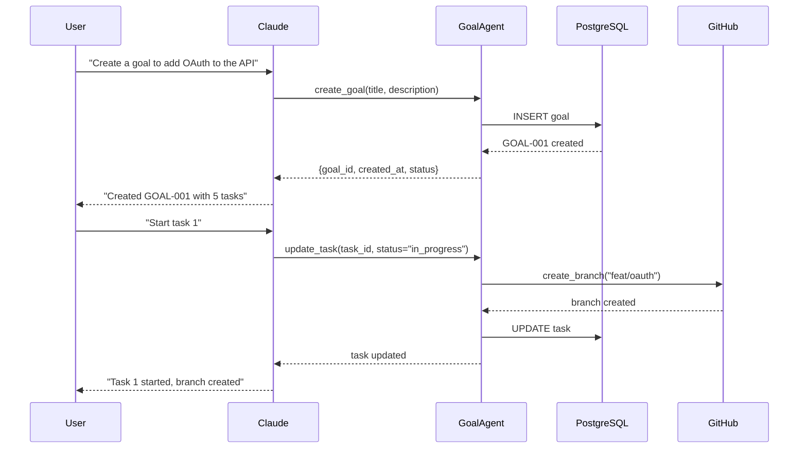

# Production MCP Servers for Claude AI

Enterprise-grade Model Context Protocol servers that transform Claude into a full-stack development assistant with GitHub, Jira, Frappe ERP, and web capabilities through intelligent goal-based orchestration.

[](https://www.python.org/downloads/)
[](https://modelcontextprotocol.io/)
[](https://opensource.org/licenses/MIT)

---

## 📚 Documentation

- **[Getting Started Guide](GETTING_STARTED.md)** - Installation and setup in 10 minutes
- **[Configuration Guide](CONFIGURATION.md)** - Environment variables and mcpctl CLI
- **[Goal Agent API](README_GOAL_AGENT.md)** - Complete API reference
- **[Architecture](ARCHITECTURE.md)** - Technical implementation details
- **[Troubleshooting](TROUBLESHOOTING.md)** - Common issues and solutions

---

## 🎯 What This Does

Transform Claude into an intelligent development assistant that can:

- **📋 Goal-Based Task Management** - Create complex projects with automatic task breakdown and dependency resolution
- **💻 GitHub Integration** - Create/update files, manage branches, create PRs, handle issues
- **🎫 Jira Management** - Create/update issues, manage sprints, link tickets, bulk operations
- **🌐 Web Access** - Google search, fetch web content, batch operations
- **💾 Persistent Storage** - PostgreSQL for durable state, Redis for performance caching
- **📊 Real-time Dashboard** - Monitor goals, tasks, and server status via WebSocket

---

## 🏗️ System Architecture

```
┌─────────────────────────────────────────────────────────────────────┐
│                       Claude Desktop Application                    │
│                  Natural Language Interface + MCP Client            │
└────────────────────────────┬────────────────────────────────────────┘
                             │
                             │ MCP Protocol (stdio/SSE)
                             │
            ┌────────────────┴─────────────────┐
            │                                  │
            ▼                                  ▼
┌─────────────────────────┐      ┌─────────────────────────┐
│    Dashboard Server     │      │   Memory Cache Server   │
│   (Port 8000, SSE)      │      │     (Redis-backed)      │
│                         │      │                         │
│ • WebSocket Updates     │      │ • 5-min TTL cache       │
│ • Server Monitoring     │◄────►│ • KV operations         │
│ • Health Checks         │      │ • Scan/batch support    │
└─────────────────────────┘      └─────────────────────────┘
            │
            │ Orchestrates all MCP servers
            │
┌───────────┴───────────────────────────────────────────────────────┐
│                                                                    │
▼                    ▼                    ▼                         ▼
┌──────────────┐  ┌──────────────┐  ┌──────────────┐  ┌──────────────┐
│ Goal Agent   │  │   GitHub     │  │    Jira      │  │  Internet    │
│              │  │              │  │              │  │              │
│ PostgreSQL   │  │ REST API     │  │ REST API     │  │ Google API   │
│ • Goals      │  │ • Repos      │  │ • Issues     │  │ • Search     │
│ • Tasks      │  │ • Branches   │  │ • Sprints    │  │ • Web Fetch  │
│ • Tags       │  │ • PRs        │  │ • Projects   │  │ • Batch Ops  │
│ • Search     │  │ • Files      │  │ • Fields     │  │              │
└──────┬───────┘  └──────────────┘  └──────────────┘  └──────────────┘
       │
       │ Optional
       ▼
┌──────────────┐
│   Frappe     │
│              │
│ ERP System   │
│ • DocTypes   │
│ • CRUD Ops   │
└──────────────┘
```

### Request Flow Example



### Data Flow

```
┌──────────────────────────────────────────────────────────┐
│                     Data Persistence                      │
├──────────────────────────────────────────────────────────┤
│                                                           │
│  PostgreSQL (Primary Store)          Redis (Cache Layer) │
│  ├─ goals                            ├─ goal:*          │
│  ├─ tasks                            ├─ task:*          │
│  ├─ goal_tags                        └─ cache:*         │
│  └─ task_tags                        (5-min TTL)        │
│                                                           │
│  Benefits:                           Benefits:            │
│  • Durable storage                   • Fast reads        │
│  • ACID transactions                 • Reduced DB load   │
│  • Complex queries                   • Optional (degrades│
│  • Foreign keys                        gracefully)       │
└──────────────────────────────────────────────────────────┘
```

---

## 🚀 Quick Start

### Prerequisites

- **Python 3.10+**
- **PostgreSQL 12+** (for Goal Agent persistence)
- **Redis 5.0+** (optional, for caching - improves performance)
- **Claude Desktop** application

### One-Command Setup

```bash
# Clone and setup
git clone https://github.com/your-org/claude-mcp-setup.git
cd claude-mcp-setup

# Install everything (creates venv, installs deps, sets up DB)
make setup

# Configure credentials (edit .env with your API tokens)
cp config/mcp_settings.json.template config/mcp_settings.json
nano config/mcp_settings.json

# Start all servers
make start
```

### Verify Installation

```bash
# Check server status
make status

# Test Goal Agent
mcpctl goal create "Test Goal" "Testing the system"

# View dashboard
open http://localhost:8000
```

**📖 For detailed setup instructions, see [GETTING_STARTED.md](GETTING_STARTED.md)**

---

## 💡 Key Features

### 1. Goal-Based Task Orchestration

```python
# Claude can do this naturally:
"Create a goal to refactor the authentication system with 3 tasks: 
1) audit current code, 2) design new system, 3) implement OAuth2"

# Automatically creates:
# GOAL-001: Refactor Authentication
#   ├─ TASK-001: Audit current code
#   ├─ TASK-002: Design new system
#   └─ TASK-003: Implement OAuth2
```

### 2. Smart Dependency Management

```python
# Define dependencies:
"Task 3 depends on Task 2"

# System enforces:
# - Task 3 can't start until Task 2 completes
# - Visual dependency graph in dashboard
# - Automatic status propagation
```

### 3. Multi-Platform Integration

```bash
# Single conversation can span multiple platforms:
"Create a Jira ticket for this bug, 
create a GitHub branch, 
fix the code, 
create a PR,
and link the Jira ticket to the PR"

# All handled seamlessly through MCP servers
```

### 4. Persistent State

```bash
# Everything persists across sessions:
- Goals and tasks in PostgreSQL
- Work history and status updates
- Tags, descriptions, metadata
- Server configurations

# Resume work anytime:
"What goals do I have in progress?"
"Show me all tasks tagged with 'urgent'"
```

### 5. Real-Time Dashboard

```
http://localhost:8000

┌─────────────────────────────────────┐
│  Goals Dashboard                    │
├─────────────────────────────────────┤
│  GOAL-001 [in_progress] OAuth      │
│    ├─ TASK-001 [completed] ✓       │
│    ├─ TASK-002 [in_progress] ...   │
│    └─ TASK-003 [pending]           │
│                                     │
│  Server Status:                     │
│    ✓ Goal Agent   (healthy)        │
│    ✓ GitHub       (healthy)        │
│    ✓ Jira         (healthy)        │
│    ✓ Memory Cache (healthy)        │
└─────────────────────────────────────┘
(Updates in real-time via WebSocket)
```

---

## 🔧 Server Components

| Server | Purpose | Persistent Storage | Key Features |
|--------|---------|-------------------|--------------|
| **Goal Agent** | Task orchestration | PostgreSQL | Goals, tasks, tags, search, dependencies |
| **GitHub** | Code management | None | Repos, branches, PRs, files, issues |
| **Jira** | Issue tracking | None | Issues, sprints, projects, workflows |
| **Internet** | Web access | None | Google search, fetch, batch operations |
| **Memory Cache** | Performance | Redis | KV store, TTL, scan, transactions |
| **Frappe** | ERP integration | None | DocTypes, CRUD, filters |
| **Dashboard** | Monitoring | None | WebSocket, health checks, UI |

---

## 📊 Performance

- **Goal Agent Queries**: ~10ms (with PostgreSQL connection pooling)
- **Dashboard Updates**: 100ms latency via WebSocket
- **Redis Cache**: 5-minute TTL, automatic fallback to PostgreSQL
- **Concurrent Requests**: Handles 100+ simultaneous operations
- **Database**: Connection pooling (5-20 connections), automatic reconnection

---

## 🛠️ Management Tools

### mcpctl CLI

```bash
# Interactive mode
mcpctl

# Quick operations
mcpctl status                          # Check all servers
mcpctl goal create "Title" "Desc"      # Create goal
mcpctl goal list                       # List goals
mcpctl task update TASK-001 completed  # Update task
mcpctl server start goal-agent         # Start specific server
mcpctl logs goal-agent                 # View logs
```

### Makefile Commands

```bash
make setup      # Complete setup from scratch
make start      # Start all servers
make stop       # Stop all servers
make status     # Check server status
make logs       # View all logs
make test       # Run tests
make clean      # Clean up temp files
make dashboard  # Open dashboard
```

---

## 🏢 Production Deployment

### Using Docker Compose

```bash
# Start everything (PostgreSQL, Redis, all MCP servers)
docker-compose up -d

# Check status
docker-compose ps

# View logs
docker-compose logs -f goal-agent

# Stop everything
docker-compose down
```

### System Requirements

**Minimum:**
- 2 CPU cores
- 4 GB RAM
- 10 GB storage
- PostgreSQL 12+
- Redis 5.0+ (optional)

**Recommended:**
- 4+ CPU cores
- 8+ GB RAM
- 20+ GB storage
- PostgreSQL 14+
- Redis 7.0+

---

## 🔒 Security

- **API Keys**: Stored in `config/mcp_settings.json` (gitignored)
- **Database**: Password authentication, SSL support
- **Redis**: Optional password authentication
- **Network**: Localhost-only by default, configurable for production
- **Secrets**: Never logged or exposed in API responses

See [CONFIGURATION.md](CONFIGURATION.md) for security best practices.

---

## 🧪 Testing

```bash
# Run all tests
make test

# Run specific server tests
pytest tests/test_goal_agent.py -v

# Test with coverage
pytest --cov=servers tests/
```

---

## 📈 Monitoring

### Health Checks

```bash
# Check via CLI
mcpctl status

# Check via HTTP
curl http://localhost:8000/health

# Dashboard
open http://localhost:8000
```

### Logs

```bash
# All logs in logs/ directory
logs/
├── goal_agent_server.log
├── github_server.log
├── jira_server.log
├── internet_server.log
├── memory_cache_server.log
├── frappe_server.log
└── dashboard.log

# Tail specific server
tail -f logs/goal_agent_server.log

# View via mcpctl
mcpctl logs goal-agent --follow
```

---

## 🤝 Contributing

Contributions welcome! Please read [CONTRIBUTING.md](CONTRIBUTING.md) first.

1. Fork the repository
2. Create a feature branch
3. Make your changes
4. Add tests
5. Submit a pull request

---

## 📜 License

MIT License - see [LICENSE](LICENSE) file for details.

---

## 🆘 Need Help?

- **Issues**: Check [TROUBLESHOOTING.md](TROUBLESHOOTING.md)
- **Questions**: Open a GitHub issue
- **Documentation**: See [docs/](docs/) directory
- **Examples**: Check [examples/](examples/) directory

---

## 🗺️ Roadmap

- [ ] Slack integration server
- [ ] Linear integration server
- [ ] Notion integration server
- [ ] GraphQL API for dashboard
- [ ] Mobile dashboard app
- [ ] Kubernetes deployment guides
- [ ] AI-powered task suggestions
- [ ] Natural language goal creation

---

**Made with ❤️ for the Claude AI community**
